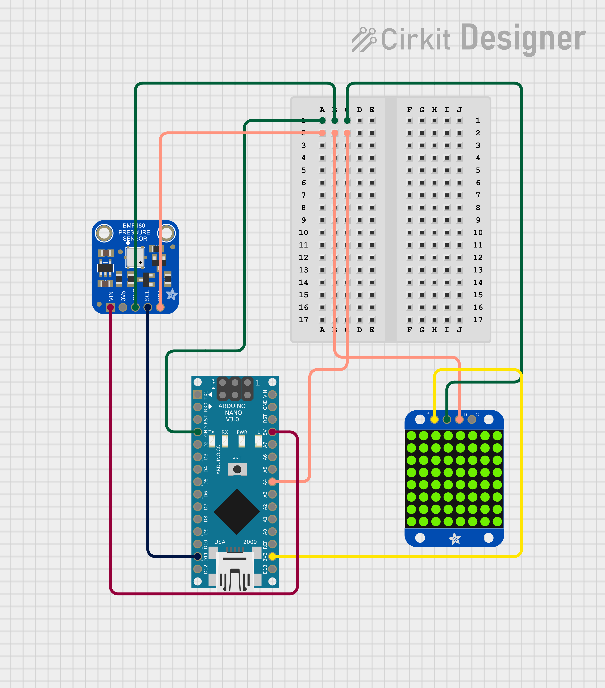

<b>LED Thermometer</b> 
The code found in the Thermometer file is used to display the room temperature using a circular object composed of 12 LEDs. The program can be configured with a start and an end temperature which will form an interval that will further be mapped to the 12 lights. The closer is the room temperature (actually it measures the temperature close to the sensor, not really the room temperature) to the upper boundary, the more LEDs will light up. This has also real life applications as it's a less abstract way of visualizing temperature rather than seeing a number and having to think about how does that temperature actually feels. Also because of it's configurability, it makes the app useful for different applications; for example boiling an egg where we only care about temperature starting form a very high temperature and we don't care about bellow 80°C. Same logic could be applied to checking engine temperature or any measurement where a number is less informative than seeing a number of LEDs light up.    

<b>Schematics</b>
 
 <b>Pre-requisites</b> 
⁍ Arduino Nano board - https://docs.arduino.cc/hardware/nano 
⁍ BMP180 (any other temperature sensor can be used for the same purpose) - https://www.apogeeweb.net/circuitry/bmp180-pinout-feature-specification.html 
⁍ Adafruit NeoPixel Ring - 12 x 5050 RGB LED - https://www.adafruit.com/product/2853 
⁍ breadboard MB-102 (or any other breadboard) - https://microcontrollerslab.com/mb102-breadboard-power-supply-module-pinout-and-how-to-use-it/ 
⁍ wires 
⁍ Wire library - https://www.arduino.cc/en/reference/wire 
⁍ Adafruit_NeoPixel library - https://www.arduino.cc/reference/en/libraries/adafruit-gfx-library/ 

 <b>Setup and build</b> 
Set the processor to ATmega328P (Old bootloader), the board to Arduino Nano and select the corresponding port. Also the user must have installed Wire and Adafruit_NeoPixel libraries. After that the only configuration left is to set the temperature boundaries. 

 <b>Running</b> 
The sensor will signal its output parameters to the board. After each read, a check is performed to see how many LEDs should light up. The user will be able to see on the circular LED device the how many LEDs turn bright and therefore associate it with a hiher/lower temperature. 

<b>Image where the range is configured 24-27 °C</b>

  
<b>Image with the same configuration after a few seconds after touching the sensor</b>

